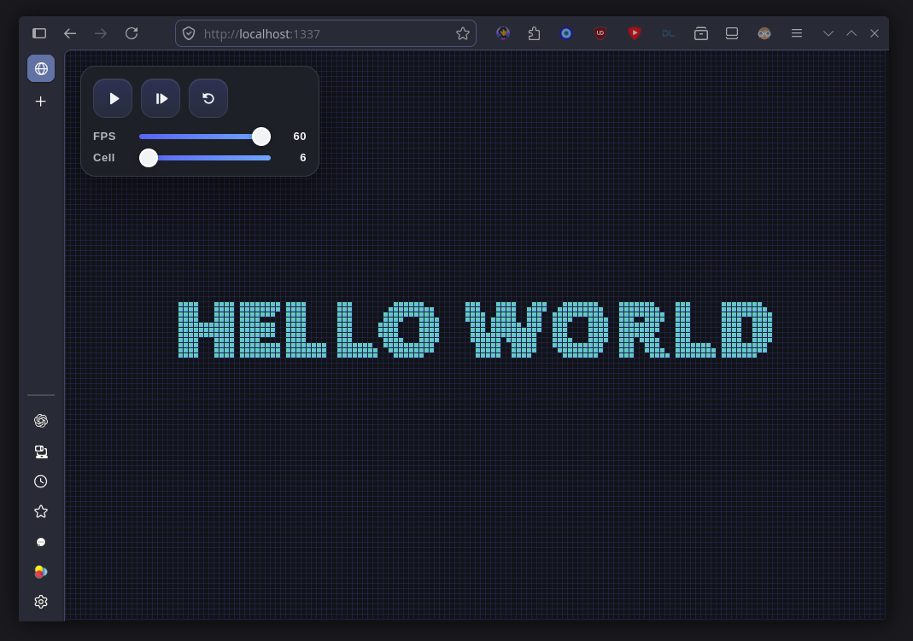

# Spawnet

Spawnet is a tiny Python project that demonstrates a single app hosting a single-page web app. The default client is a Conway's Game of Life scene served locally on `127.0.0.1:1337`, and the same entrypoint can also bundle the full `client/` directory into self-contained build artifacts.



## Quick Start

Install `uv` first if you do not already have it:

```bash
curl -LsSf https://astral.sh/uv/install.sh | sh
```

Then install the project environment:

```bash
uv sync
```

If you prefer `pip`, you can use a virtual environment instead:

```bash
python3 -m venv .venv
. .venv/bin/activate
python3 -m pip install -U pip pyinstaller
```

Run the dev server:

```bash
uv run spawn.py
```

or explicitly:

```bash
uv run spawn.py serve --host 127.0.0.1 --port 1337
```

Build a single-file Python artifact into `bin/`:

```bash
uv run spawn.py build --mode py
```

Build a zipapp for Linux/macOS-style Python execution:

```bash
uv run spawn.py build --mode pyz --output spawnet-app
python3 bin/spawnet-app.pyz
```

Build a Windows `.exe`:

```bash
uv sync
uv run spawn.py build --mode exe --output spawnet
```

`pip` users can run the same commands after activating the virtual environment:

```bash
python3 spawn.py
python3 spawn.py build --mode py
python3 spawn.py build --mode pyz --output spawnet-app
python3 spawn.py build --mode exe --output spawnet
```

## Build Modes

- `py`: writes a single self-contained Python file with all `client/` assets embedded.
- `pyz`: writes a self-contained Python zipapp that runs with `python3`.
- `exe`: uses PyInstaller to create a Windows executable. This is simplest when run on Windows.

## Notes

- The build step recursively packages everything inside `client/`.
- Bare output names are written to `bin/`.
- Relative output paths with directories are respected as given.
- `uv sync` installs the build dependency needed for `.exe` output.
